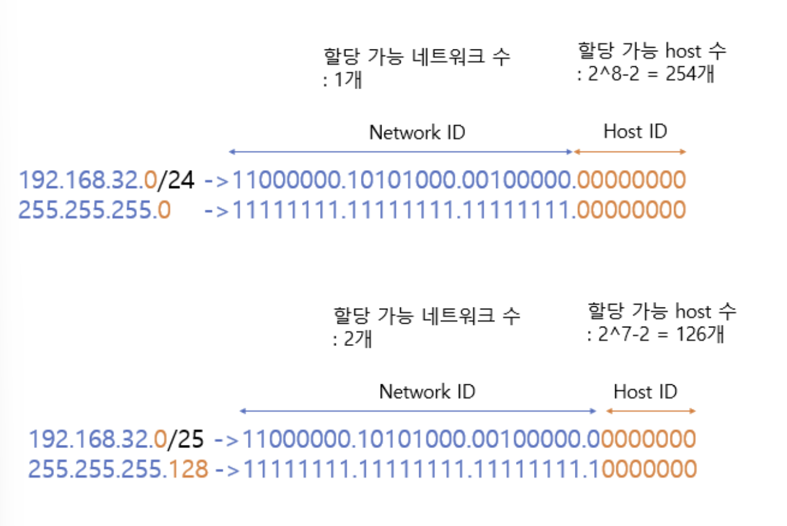

- **AWS**
    - **Amazon Web Service**
    - 세계적으로 가장 포괄적인 클라우드 플랫품
- **리전과 가용영역**
    - **리전**
        - 한 곳에 대규모의 서버 컴퓨터 모아둔다면
            - 자연 재해 발생 시 모든 서비스 마비
            - 모든 자원이 북미에 있다면 아시아는 서비스 느림
        - 이를 해결하고자 서비스를 위한 자원들을 여러 곳에 분산 배치
    - **가용영역**
        - 리전을 한 번 더 분산 배치
- **서브네팅**

    - **서브넷 마스크(Default Subnet mask)**
        - 기본 서브넷 마스크
            
            
            
        - 기본 서브넷 마스크의 이용
            
            
            
            - IP 주소에 서브넷 마스크를 AND 연산하면 Network ID가 된다
                - AND 연산 : 둘 다 1이어야 1
            - 192.168.32.0/24 에서 **‘/24’** 는 서브넷 마스크의 왼쪽에서부터 24개가 1이라는 의미
    
    - IP주소 낭비 방지를 위해 서브넷 마스크를 이용하여 원본 네트워크를 여러 개의 서브넷으로 분리하는 과정
    - 서브넷 마스크의 bit 수를 증가시키는 것
        - 서브넷 마스크 bit 수 1씩 증가하면 할당 가능 네트워크 2배 증가, 호스트 수 2배 감소
    - 192.168.32.0/24 → 192.168.32.0/25 변경
        
        
        
        - host 수에서 -2 하는 이유 :
            - 첫 번째 주소 192.168.32.0 → Network Address
            - 마지막 주소 192.168.32.255 → Broadcast
                
                → 따라서 host 할당 불가
                
    - **서브넷팅 예제(1)**
        - **211.100.10.0/24 네트워크 각 서브넷당 55개의 Host 할당 가능하도록 서브넷팅**
            - **a)** 서브넷 마스크 구하기
                - 55개의 host 이므로 최소 6비트 필요 → 2^6-2=62
                - 11111111.11111111.11111111.11000000 이므로
                    
                    → **255.255.255.192**
                    
            - **b)** 서브넷 개수 구하기
                - 256 - 192 = 64 , 256/64 = **4개**
                - 혹은 2^2 = **4개**
            - **c)** 첫 번째 서브넷의 broadcast address 구하기
                - 이진법 계산 → 11010011.01100100.00001010.00000000
                    
                    → 서브넷이 2^6 = 64개의 호스트 가질 수 있다
                    
                    첫 번째 서브넷의 네트워크 주소 → 211.100.10.0
                    
                    첫 번째 서브넷의 네트워크 주소 → **211.100.10.63**
                    
            - **d**) 마지막 서브넷의 network address 구하기
                - **211.100.10.192**
            - **e)** 두 번째 서브넷의 사용 가능 IP 범위 구하기
                - 두 번째 서브넷은 211.100.10.64 ~ 211.100.10.127
                    
                    → ~.64 와 ~.127은 각각 network, broadcast 주소이므로 사용 범위는 **211.100.10.65 ~ 211.100.10.126**
                    
    - **서브넷팅 예제(2)**
        - 195.168.12.0/24 네트워크를 8개의 네트워크로 활용할 수 있도록 서브넷팅한다
            - **a)** 어떤 서브넷 마스크가 효율적인가
                - 8개의 서브넷 만드려면 서브넷 마스크 bit 개수 3개 늘려야 한다. 2^3 =8
                    
                    → 서브넷 마스크 ⇒ 11111111.11111111.11111111.11100000
                    
                    ⇒ **255.255.255.224**
                    
            - **b)** 서브넷의 개수
                - 2^3 = **8개**
            - **c)** 첫 번째 서브넷의 broadcast address
                - 할당 가능 호스트는 2^5 = 32개 이다. 첫 번째 서브넷의 IP 주소 범위는 195.168.12.0 ~ 195.168.12.31 이다.
                    - 195.168.12.0 → network address
                    - **195.168.12.31** → broadcast address
            - **d)** 마지막 서브넷의 network address
                - 0~255를 32씩 나눈다. 마지막 서브넷 IP 주소 범위
                    
                    →  195.168.12.224 ~ 19.168.12.255
                    
                    ⇒ **195.168.12.224**
                    
            - **e)** 두 번째 서브넷의 사용 가능한 IP 범위
                - **195.168.12.33 ~ 195.168.12.62 (network, broadcast 제외)**
- **라우팅**
    - 데이터의 목적지가 어디인지 확인하고 빠르고 정확한 길을 찾아 전달하는 것
    - **라우터** : 여러 네트워크들의 연결 담당
    - 필요한 것 :
        - 출발지와 목적지의 네트워크 정보
        - 목적지로 가는 모든 경로
        - 최적 경로
        - 지속적인 네트워크 상태 확인
    - **정적 라우팅**
        - 수동으로 라우팅 테이블 생성
        - 장점 :
            - 속도 빠르고 안정적, 메모리 소모 적다
            - 네트워크 대역폭 절약, 보안에 강하다
        - 단점 :
            - 경로를 수동으로 추가해서 번거롭다
            - 정해진 경로에 장애 발생시 네트워크 전체 장애 발생
    - **동적 라우팅** :
        - 자동으로 라우팅 테이블 생성
        - 장점 :
            - 관리자는 초기 설정만 해준다
            - 규모가 큰 네트워크에서 사용 가능
        - 단점 :
            - 다른 라우터들과 계속 통신해서 많은 대역폭 소비
- **VPC ⭐**
    - Amazon Virtual Private Cloud
    - AWS 클라우드에서 다른 고객과 완벽하게 논리적으로 격리된 네트워크 공간을 제공하여 가상 네스워크에서 AWS 리소스를 만드는데 사용하는 리소스
    - 생성에 필요한 요소 :
        - 리전
        - 가용영역
        - VPC
        - CIDR
        - 서브넷
        - 라우팅 테이블
        - 인터넷 게이트웨이
        - 네트워크 ACL & 보안그룹
- **사설 IP주소**
    - 공유기에 연결되어 있는 가정이나 회사의 각 네트워크 기기에 할당한다
    - 특정 네트워크 안에서만 내부적으로 사용되는 고유한 주소
    - 컴퓨터에서 사용하는 로컬 IP, 내부에서만 접근 가능
    - **사설망 :** 사설 IP 를 그룹으로 묶는 방법
- **포트포워딩**
    - 하나의 공용 IP 주소를 가진 공유기가 자신의 포트를 통해 올바른 사설 IP 주소를 가진 디바이스에게 데이터를 주는 것
    - 포트포워딩의 포트와 소켓의 포트는 연관 X
- **NAT 프로토콜**
    - 인터넷 주소 번역 기능

      

    - 공유기에 연결되어 있는 각 사내 컴퓨터들의 사설 IP 를 유일한 공인 IP 로 변환 → 외부 인터넷으로 공인 IP 주소 정보 보내기
    - 외부에서는 사내의 누가 보냈는지 알 수 없지만 답변하면 공유기가 알아서 보낸 사람에게 전달해준다
- **포트번호**
    - 통신 과정에서 IP 주소를 통해 컴퓨터를 식별했을 때, 해당 컴퓨터에서 어떤 프로세스에게 데이터를 보내야 하는지 알아야 한다. 이때 사용되는 **식별 값**