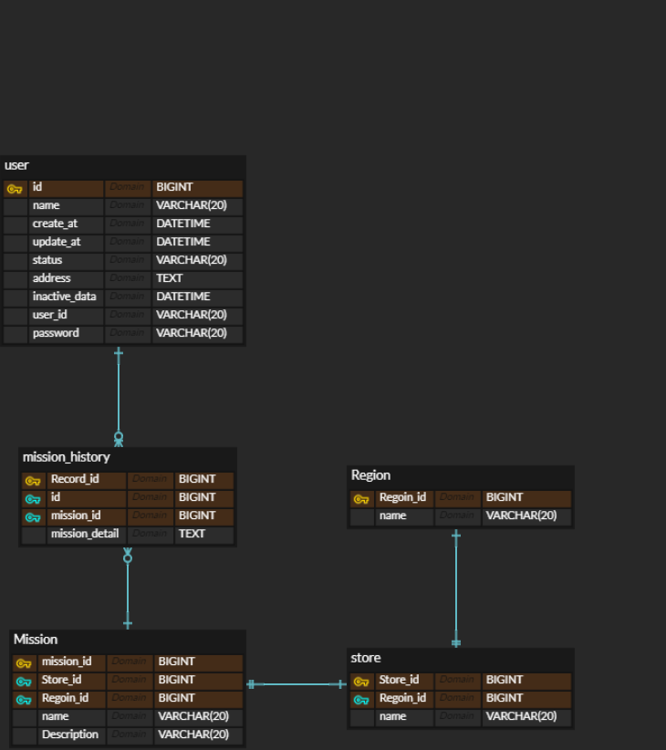

# WEEK 1 - 문창원
## 핵심 키워드

 

## 실습 인증

 

## 키워드
1. 외래키 : 데이터베이스 테이블의 Foreign Key를 표현
2. 기본키 : 데이터베이스 테이블의 Primary Key를 표현, 중복 x, NULL x
3. ER 다이어 그램 : 개체 관계도 즉, 엔티티와 속성들의 관계를 그림으로 표현한 것
4. 복합키 : 두 개 이상의 컬럼을 묶어서 하나의 기본키로 지정하는 것
5. 연관 관계 : 1:1 or 1:N or M:N , O이 존재하면 선택, |이 존재하면 필수
6. 정규화 : 중복 데이터가 없게끔 데이터를 분해하는 과정
7. 반 정규화 : 데이터 베이스의 성능 향상을 위해 데이터 중복을 허용하고 조인을 줄이는 방법

## 미션
1.